## Host your Google Action on AWS Lambda

- [Create a Lambda Function](#create-a-lambda-function)
- [Upload Your Code](#upload-your-code)
- [Test Your Lambda Function](#test-your-lambda-function)
- [Create API Gateway](#create-api-gateway)
- [Add Endpoint to Dialogflow](#add-endpoint-to-dialogflow)
	- [a) Agent Fulfillment Section](#a-agent-fulfillment-section)
	- [b) Add Webhook to Intents](#b-add-webhook-to-intents)


[AWS Lambda](https://aws.amazon.com/lambda/) is a serverless hosting solution by Amazon. Many Alexa Skills are hosted on this platform, thus it might make sense for you to host your cross-platform voice application (including your Google Action). This is what we're going to do in this section. This usually takes a few steps, so be prepared.

### Create a Lambda Function

Go to [aws.amazon.com](https://aws.amazon.com) and log into your account (or create a new one): 

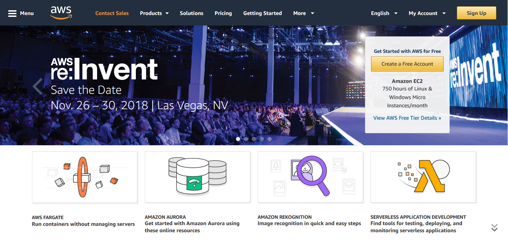

 Go to the [AWS Management Console](https://console.aws.amazon.com): 

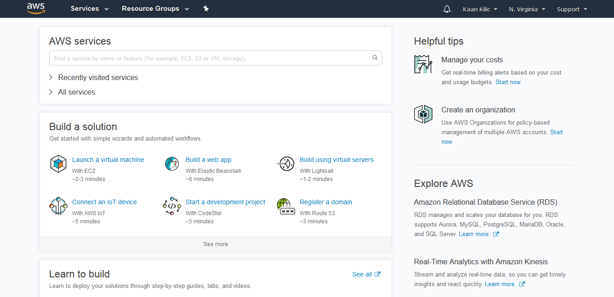

 Search for "lambda" or go directly to [console.aws.amazon.com/lambda](https://console.aws.amazon.com/lambda): 

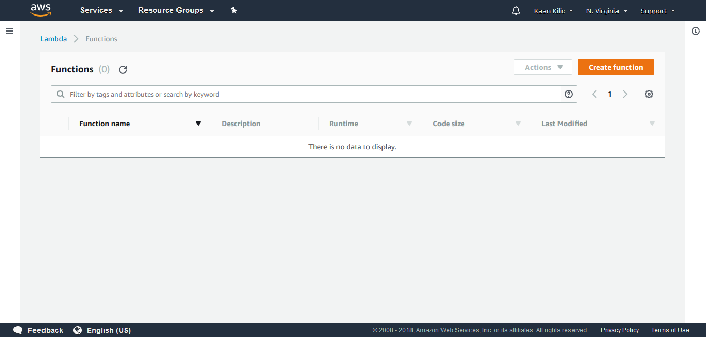

 Click "Create a Lambda function", choose "Author from scratch" and fill out the form: 

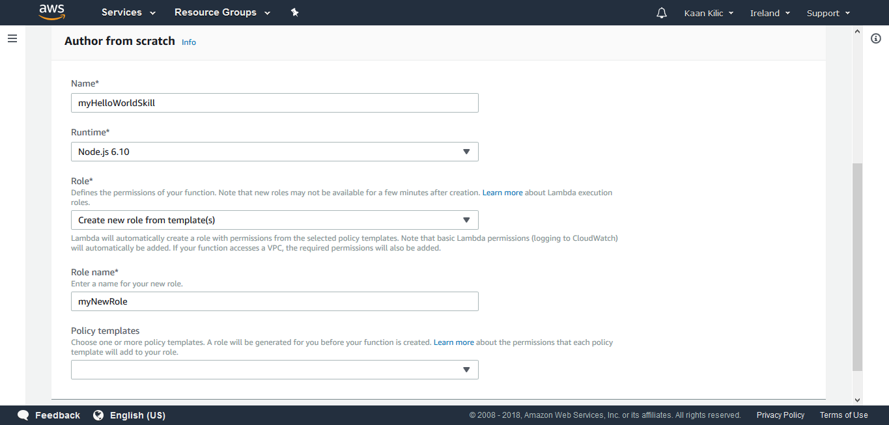

 You can either choose an existing role (if you have one already), or create a new one. We're going to create one from a template and call it "myNewRole" with no special policy templates: Now it's time to configure your Lambda function. Let's start by adding the Alexa Skills Kit as a trigger: 

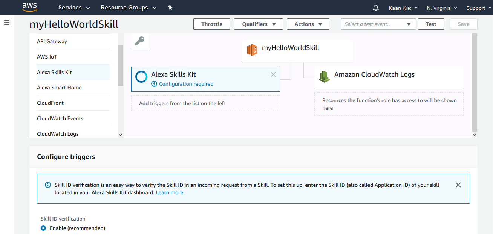

 You can enable skill ID verification, if you want, but it's not neccessary. 

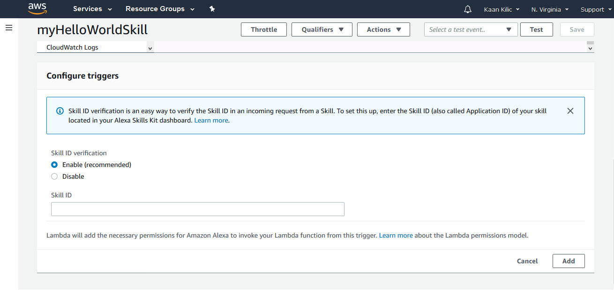

### Upload Your Code

Now let's get to the fun part. You can either enter to code inline, upload a zip, or upload a file from Amazon S3. As we're using other dependencies like the [jovo-framework npm package](https://www.npmjs.com/package/jovo-framework), we can't use the inline editor. We're going to zip our project and upload it to the function. To upload the code to Lambda, please make sure to zip the actual files inside the directory, **not** the HelloWorld folder itself: 


 Let's go back to the AWS Developer Console and upload the zip: 

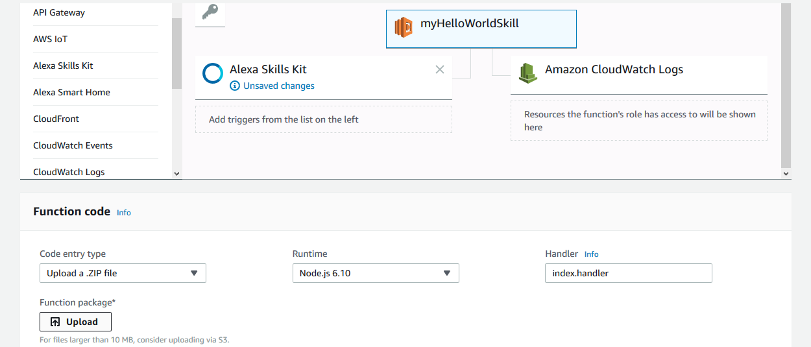

 Now save your changes with the orange button in the upper right corner: 


### Test Your Lambda Function

Great! Your Lambda function is now created. Click "Test" right next to the "Save" button and select "Alexa Start Session" as the event template, since the [Jovo Framework](https://www.jovo.tech) supports both Google Action and Amazon Alexa requests: 

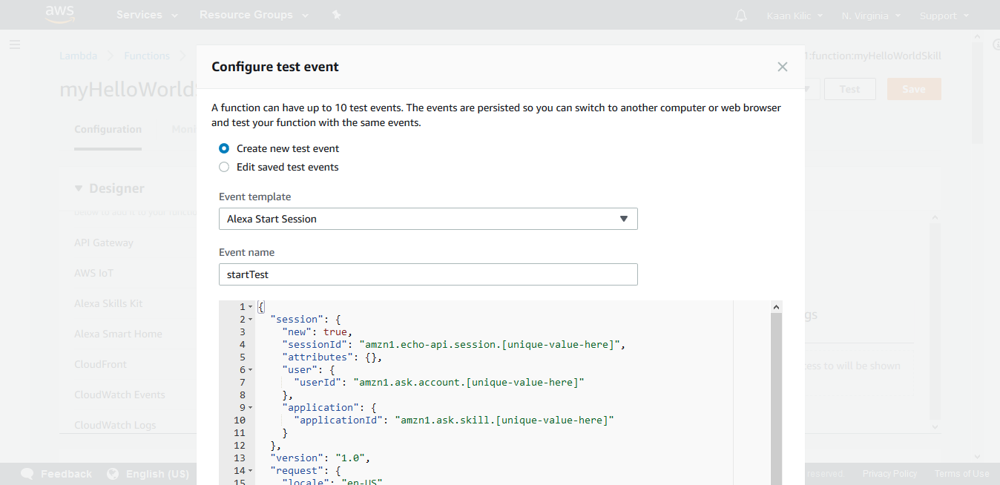

 Click "Test," aaand 🎉 it works! 

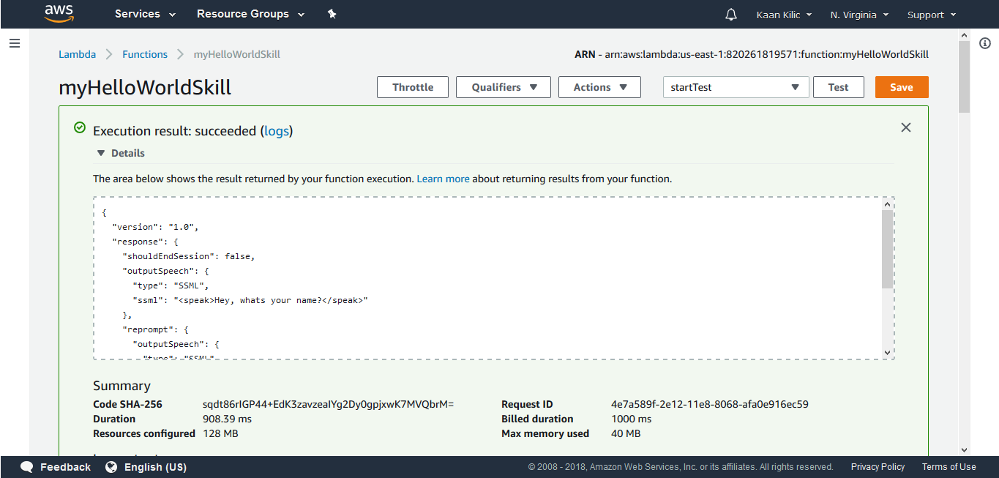

 If you want to test it with a "real" Google Assistant request, you can also copy-paste this one:
```javascript
{
	"originalRequest": {
		"source": "google",
		"version": "2",
		"data": {
			"isInSandbox": true,
			"surface": {
				"capabilities": \[
					{
						"name": "actions.capability.AUDIO_OUTPUT"
					},
					{
						"name": "actions.capability.SCREEN_OUTPUT"
					}
				\]
			},
			"inputs": \[
				{
					"rawInputs": \[
						{
							"query": "talk to my test app",
							"inputType": "KEYBOARD"
						}
					\],
					"intent": "actions.intent.MAIN"
				}
			\],
			"user": {
				"locale": "en-US",
				"userId": "1501754379730"
			},
			"device": {},
			"conversation": {
				"conversationId": "1501754379730",
				"type": "NEW"
			}
		}
	},
	"id": "ce231a64-af08-4c33-bfa3-0724a80d5b2c",
	"timestamp": "2017-08-03T09:59:39.741Z",
	"lang": "en",
	"result": {
		"source": "agent",
		"resolvedQuery": "GOOGLE\_ASSISTANT\_WELCOME",
		"speech": "",
		"action": "input.welcome",
		"actionIncomplete": false,
		"parameters": {},
		"contexts": \[
			{
				"name": "google\_assistant\_welcome",
				"parameters": {},
				"lifespan": 0
			},
			{
				"name": "actions\_capability\_screen_output",
				"parameters": {},
				"lifespan": 0
			},
			{
				"name": "actions\_capability\_audio_output",
				"parameters": {},
				"lifespan": 0
			},
			{
				"name": "google\_assistant\_input\_type\_keyboard",
				"parameters": {},
				"lifespan": 0
			}
		\],
		"metadata": {
			"intentId": "b0b7962c-cae0-4437-bddf-e72f457959d6",
			"webhookUsed": "true",
			"webhookForSlotFillingUsed": "false",
			"nluResponseTime": 2,
			"intentName": "Default Welcome Intent"
		},
		"fulfillment": {
			"speech": "Greetings!",
			"messages": \[
				{
					"type": 0,
					"speech": "Hi!"
				}
			\]
		},
		"score": 1
	},
	"status": {
		"code": 200,
		"errorType": "success"
	},
	"sessionId": "1501754379730"
}
```

### Create API Gateway

For Alexa Skills, you can just use the Lambda function's ARN to proceed, for Dialogflow, we need to create an API Gateway. Go to [console.aws.amazon.com/apigateway](https://console.aws.amazon.com/apigateway) to get started: 

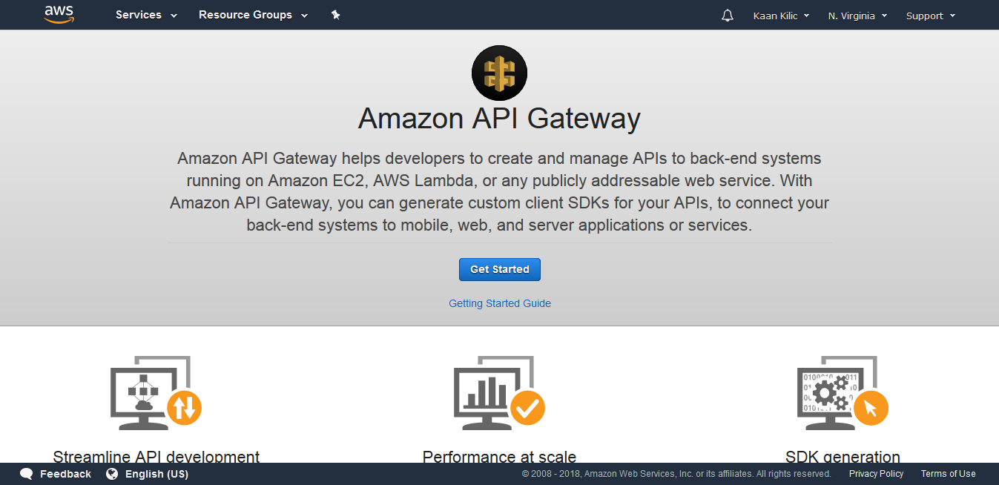

 Let's create a new API called "myGoogleActionAPIGateway" (you can call it whatever, though): 

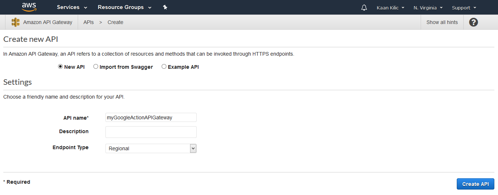

 After successful creation, you will see the Resources screen. Click on the "Actions" dropdown and select "New Method": 

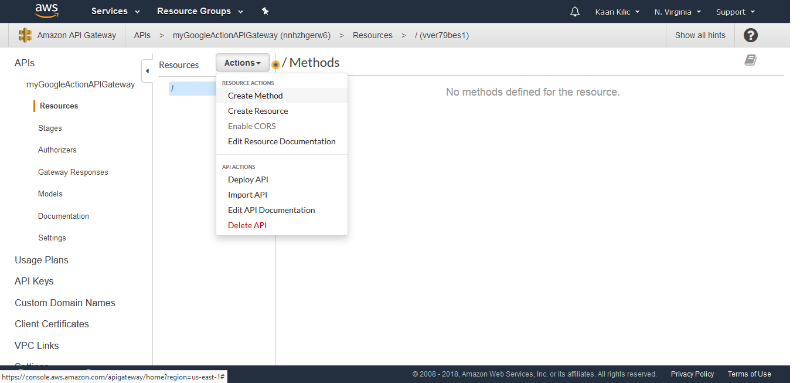

 Dialogflow needs a webhook where it can send POST requests to. So let's create a POST method that is integrated with our existing Lambda function: 

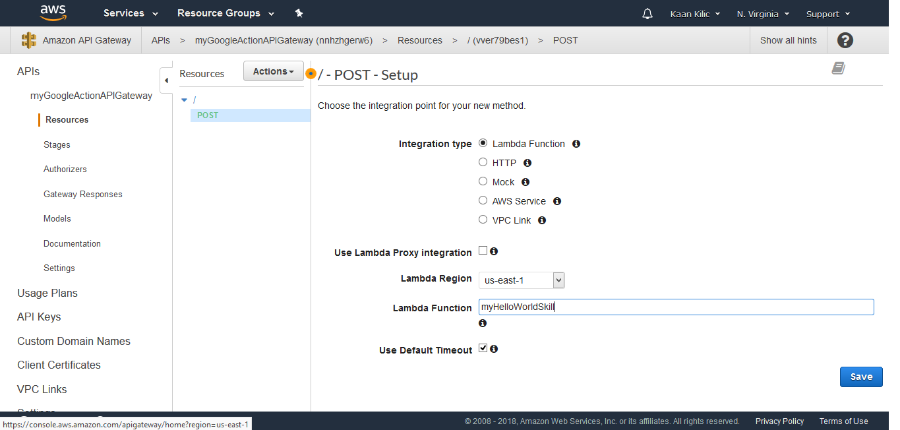

 Grant it permission: 


 And that's almost it. You only need to deploy the API like this: 

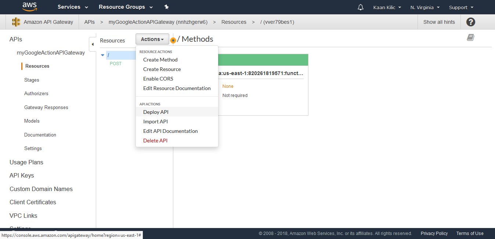

 And create a new stage: 


 Yes! Finally, you can get the URL for the API Gateway from here: 

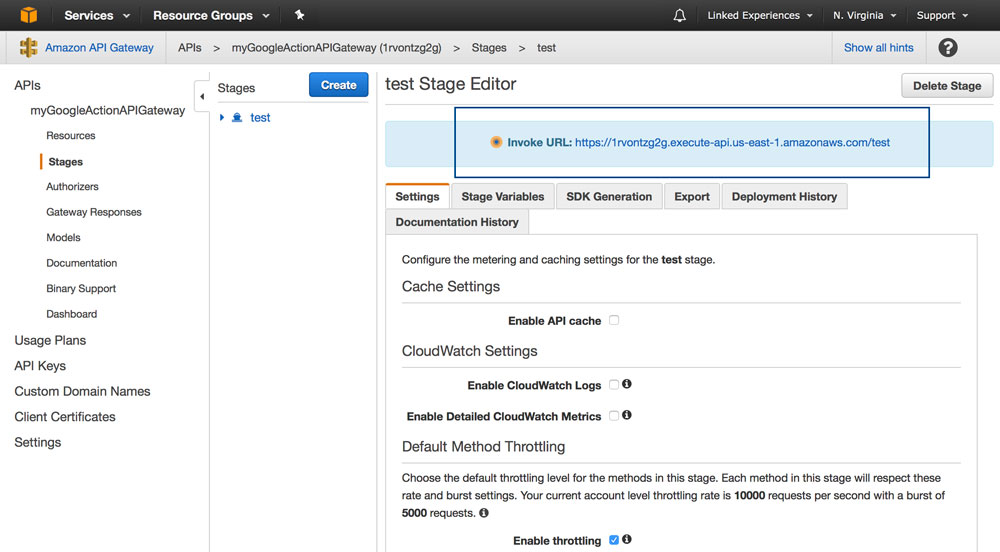

### Add Endpoint to Dialogflow
-----------------------------

Now that have our API Gateway to AWS Lambda set up, it's time use the provided URL to connect our application with our agent on Dialogflow.

*   [a) Agent Fulfillment Section](#agent-fulfillment)
*   [b) Add Webhook to Intents](#intents-webhook)

#### a) Agent Fulfillment Section

Go back to the Dialogflow console and choose the **Fulfillment** navigation item. Enable the webhook and paste your API Gateway URL: 


#### b) Add Webhook to Intents

Dialogflow offers the ability to customize your language model in a way that you can choose for every intent how it's going to be handled. This means we need to enable **webhook fulfillment** for every intent we use in our model. Go to HelloWorldIntent first and check "Use webhook" in at the bottom of the page: 

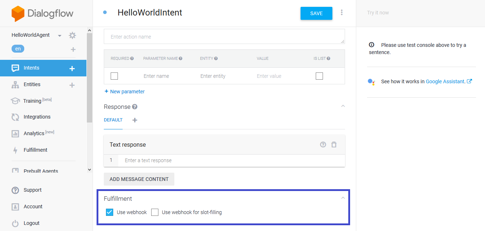

 Do the same for the "MyNameIsIntent" and also take a look at the "Default Welcome Intent" and don't forget to check the box there as well. The intent comes with default text responses, which would otherwise cause random output instead of your model, when the application is launched. 

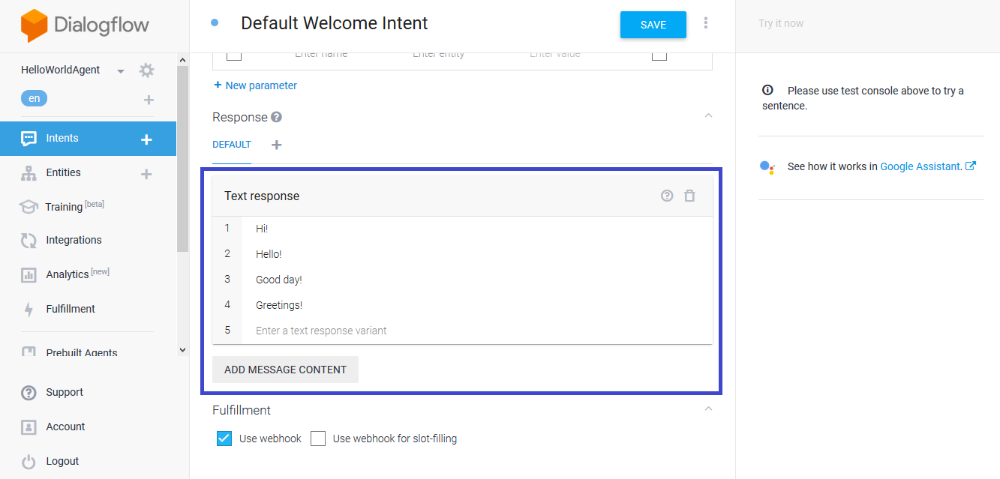

That's it!